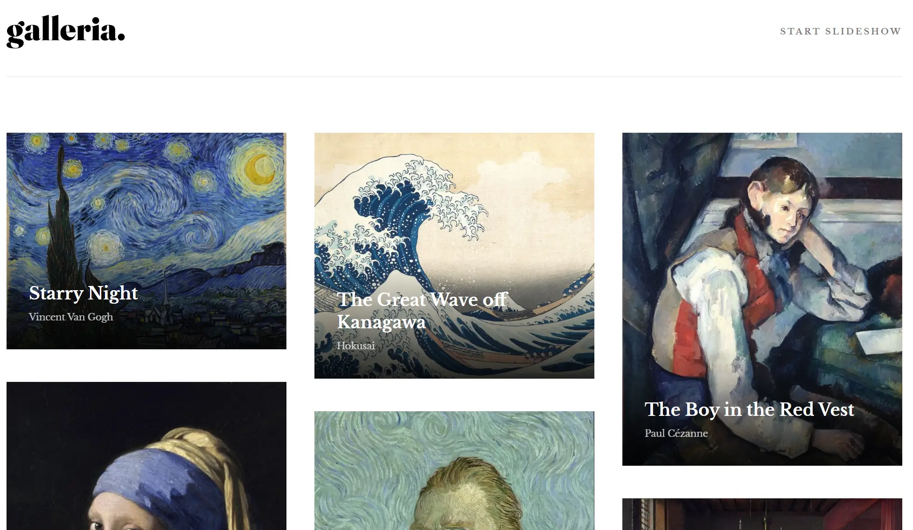

# galleria 🎨

Welcome to the galleria project! This is a result of the challenge provided by Frontend Mentor.

## Table of Contents

- [galleria 🎨](#galleria-)
  - [Table of Contents](#table-of-contents)
  - [About The Project](#about-the-project)
  - [Technologies](#technologies)
  - [Getting Started](#getting-started)
    - [Installation](#installation)
  - [Usage](#usage)
  - [Roadmap](#roadmap)
  - [Contributing](#contributing)
  - [Acknowledgments](#acknowledgments)

## About The Project

The objective was to build an interactive and visually appealing art gallery that users can explore on their browsers.

## Technologies

- Vue: 3.3.4
- Typescript: 5.0.2
- Tailwind: 3.3.5

## Getting Started

Here is how you can set up this project by yourself. To get a local copy up and running, follow these simple example steps.

### Installation

1. Clone the repository.
2. Install NPM packages and run the app using `npm run dev`

## Usage

Below, you can read the features of the galleria.

1. Interactive Gallery: Explore a variety of artworks in a virtual environment.
2. Responsive Design: Optimized for desktop and mobile screens.

## Roadmap

- [ ] Add more artworks to the gallery
- [ ] Implement a feature to allow users to upload their own artworks

## Contributing

Any contributions you make are **greatly appreciated**.

If you have a suggestion that would make this better, please fork the repo and create a pull request. You can also simply open an issue.

1. Fork the Project
2. Create your Feature Branch (`git checkout -b feature/AmazingFeature`)
3. Commit your Changes (`git commit -m 'Add some AmazingFeature'`)
4. Push to the Branch (`git push origin feature/AmazingFeature`)
5. Open a Pull Request

## Acknowledgments

- [Frontend-Mentor](https://www.frontendmentor.io/challenges/galleria-slideshow-site-tEA4pwsa6)
- [Best-README-Template](https://github.com/othneildrew/Best-README-Template)
